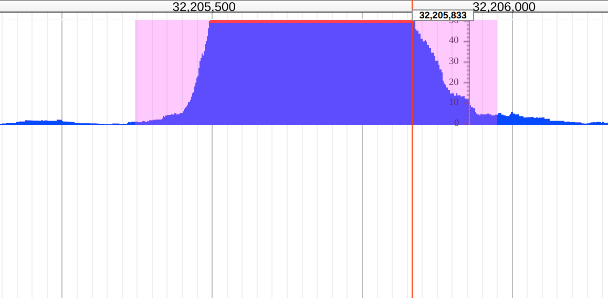

# wigglehighlighter

A JBrowse plugin for plotting a highlight based on data in a bigbed file over a Wiggle track

## Example configs

Example for trackList.json

      {
         "urlTemplate" : "yourfile.bw",
         "bigbed": { "urlTemplate": "yourfile.bb" },
         "label" : "Track",
         "type" : "WiggleHighlighter/View/Track/XYPlot"
         "highlightColor": "#f0f2",
         "broaden": 100
      }

## Note

This is very beta feel free to provide feedback though

## Screenshot

Showing default settings on an ENCODE bigbed file and bigwig file with highlighting and broadening of the peak coordinates

## Install

- Clone repo into plugins folder in JBrowse and name folder WiggleHighlighter
- Add "plugins": ["WiggleHighlighter"] to trackList.json or jbrowse_conf.json

Please see http://gmod.org/wiki/JBrowse_FAQ#How_do_I_install_a_plugin for more information about installing plugins

Still in beta! Feel free to provide feedback
